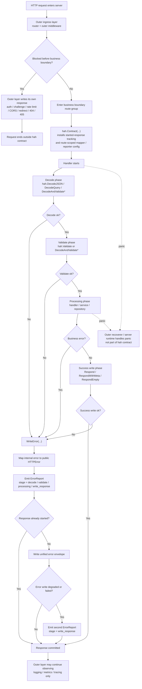

# 技术指导文档

本文面向 `hah` 的维护者与贡献者，说明项目当前的技术定位、设计约束与实现原则。

文档边界：

- `README.md` 是对外唯一公开文档，只负责说明库的定位、公开契约与使用方式
- 本文档只讨论实现原则、内部边界、测试口径与后续演进约束
- 日志记录策略的内部细则见 `docs/LOGGING_STRATEGY.md`
- request id 的内部策略见 `docs/REQUEST_ID_STRATEGY.md`
- 如果某个改动会影响用户可观察的公开行为，应先更新 `README.md`，再调整实现

## 1. 项目定位

`hah` 是一个保持 `net/http` 原生兼容、同时适配 `chi` 等路由栈的业务边界 JSON API 契约层。

它的关注点不是整个 HTTP 生命周期，而是“请求已经被允许进入业务边界之后，这个 API 应该如何稳定地解码、映射、写回和观测”。

核心目标：

- 把进入业务边界后的 JSON API 公开行为收敛成稳定契约
- 保持 `chi` / `net/http` 原生写法，不引入新的 framework runtime
- 让 handler 继续显式控制成功响应
- 让错误映射、错误观测与错误写回保持集中式策略
- 在边界自故障时维持 fail-closed

明确的非目标：

- 不接管整个 HTTP 请求生命周期
- 不接管 auth、rate limit、CORS、redirect、challenge 这类业务边界之前的拦截逻辑
- 不接管系统级 panic capture
- 不发明新的私有 handler 协议
- 不要求所有 middleware 都接入 `hah`

## 2. 边界定义与职责分层

维护时必须先区分两层边界：

- 业务边界之前的 HTTP 接入层
- 业务边界之内的 API 契约层

### 2.1 业务边界之前

这层通常由 router 外围或 router 级 middleware 处理，例如：

- access log
- request id
- auth / challenge
- rate limit
- CORS
- redirect
- panic recover

这些逻辑本来就属于 `chi` / `net/http` 的正常职责分配。
它们可以返回自己的响应，不必为了和业务 JSON API 统一而强行接入 `hah`。
这层通常也已经有 access log、metrics、trace 或网关日志，因此并不是“完全无感知”的黑洞。

### 2.2 业务边界之内

一旦请求已经被允许进入业务 handler 链，`hah` 才开始承担职责：

- 统一成功响应 envelope
- 统一业务边界错误 envelope
- 统一请求解码与输入校验语义
- 统一业务错误到公开错误的映射
- 统一边界内错误观测

这一层的职责分配应保持清晰：

- handler 显式决定是否写回成功结果
- service / repository 返回失败事实，而不是直接写 HTTP 响应
- 边界层把失败事实映射成安全可公开的错误响应

## 3. 设计理念

`hah` 继续接受“集中式 error handling”这个目标，但要把它解释为“集中式策略”，而不是“隐式 runtime”。

这意味着：

- 集中的是映射、观测、写回策略
- 不集中接管整条请求控制流
- 不依赖隐藏的 request error state
- 不依赖请求结束时再回收一次错误
- 不要求调用方接受新的 handler contract

需要特别明确的是：

- 集中式处理本身不是当前的性能问题
- 当前主要问题是响应处理过程过于隐式，容易让 `hah` 看起来像一个 runtime
- 后续设计应优先降低隐式性和侵入性，而不是为了“更集中”继续扩张运行时语义

`hah` 应坚持的阅读体验是：

- 成功路径显式
- 失败路径显式
- 策略集中
- 控制流透明

还需要特别提醒维护者：

- `Mapped Internal Error Mode` 的上手门槛，不是 `hah` 人为制造的新复杂度，而是结构化 HTTP API 本来就必须面对的设计成本
- 即使完全不用 `hah`，只要项目想统一成功响应、统一错误响应、稳定错误码、局部错误映射和结构化观测，这些问题也仍然要自己回答
- `chi` / `net/http` 的哲学本来就是把这些决定权交给调用方，而不是替调用方预设一整套 runtime
- `hah` 的价值不在于消灭这层复杂度，而在于把这层复杂度显式收敛到业务边界，避免它散落到各个 handler、middleware 和 feature 中长期发散

因此，后续演进时不应把“门槛存在”误判为“应该重新引入隐式 runtime”。
更合理的方向是继续提高边界规则的可读性、可挂载性和局部复用能力，同时保持成功路径与失败路径都必须显式表达。

## 4. 推荐运行时模型

当前推荐模型如下：

1. 外层 middleware 先处理 request id、日志、auth、rate limit、CORS、recover 等接入层职责
2. 在进入业务边界的 route group 上显式挂载很薄的 `hah.Contract(...)`
3. 只有被允许进入业务边界的请求，才进入 `hah` 关心的 handler 链
4. handler 内部使用 `hah.Decode*` / `hah.Validate` 处理输入
5. 业务层返回错误时，由边界显式调用统一错误写回入口立即返回
6. 成功结果仍由 handler 显式调用 `Respond*` 写回
7. 如果响应写回本身失败，`hah` 负责 fail-closed 与补充观测

这里要特别明确：

- `hah` 负责写出业务边界内的最终错误响应
- 外层系统可以继续观测、采集、打点，但不应被描述成“再处理一次这个响应”
- 响应一旦写出，外层通常只能观察，不能再安全改写

### 4.1 请求流程图

下面的流程图描述了当前推荐模型下，一个请求从进入 HTTP 接入层，到离开业务边界的完整路径。



### 4.2 阶段说明

为了避免维护者把运行时边界重新混成一个隐式框架，建议始终按下面的阶段理解请求流转：

| 阶段 | 归属 | 典型 API / 机制 | `hah` 观测 `stage` | 说明 |
| --- | --- | --- | --- | --- |
| 接入层入口 | router / outer middleware | request id、access log、auth、rate limit、CORS、recover | 不属于 `hah` 默认阶段 | 这层可以直接拦截并返回自己的响应，不必接入统一 JSON 契约 |
| 业务边界挂载 | `hah.Contract(...)` | tracking writer、route-scoped mapper、route-scoped reporter | 不单独产出阶段 | 只是显式边界挂载点，不做 deferred error handling |
| 解码 | 边界 helper | `DecodeJSON`、`DecodeQuery`、`DecodeAndValidate*` 的 decode 部分 | `decode` | 负责把请求形状错误归一化为公开 4xx |
| 校验 | 边界 helper | `Validate`、`DecodeAndValidate*` 的 validate 部分 | `validate` | 负责把 `[]Violation` 归一化为 `422 invalid_request` |
| 处理 | handler / service / repository | 业务逻辑、自定义 mapper | `processing` | 覆盖业务链本身；`hah` 不再细分 handler / service / repository |
| 成功写回 | handler | `Respond`、`RespondWithMeta`、`RespondEmpty` | 成功时不产出错误观测；失败时进入 `write_response` | 成功路径始终显式，由 handler 决定是否写回以及写回什么 |
| 错误写回 | 边界 helper | `WriteError` | 初次观测沿用错误来源阶段 | 先映射、再观测、再写统一错误响应 |
| 响应写回降级 | 边界 helper | error writer / success writer fail-closed | `write_response` | 用于记录错误响应序列化失败、错误写回失败、成功写回失败后的补充观测 |
| 外层扫尾观测 | outer middleware / server runtime | access log、metrics、trace | 不属于 `hah` 默认阶段 | 响应写出后，这层通常只能观察，不能安全改写 |
| panic 恢复 | outer recoverer / server runtime | recover middleware、server runtime | 不属于 `hah` 默认阶段 | panic 不属于 `hah` 默认处理范围 |

### 4.3 维护者阅读顺序

维护和审查实现时，建议按下面的顺序理解一次请求：

1. 先问这个请求是否已经在业务边界之前被外层 middleware 拦截。
2. 如果没有，再看它是否通过 `Contract(...)` 进入了 `hah` 关心的业务边界。
3. 进入边界后，先看 `decode`，再看 `validate`，最后看 `processing`。
4. 一旦任何一步产生错误，控制流应在发生点立即转向 `WriteError(...)` 并结束。
5. 成功路径只看 handler 是否显式调用了 `Respond*`。
6. 如果响应写回失败，再看是否正确进入 `write_response` 观测和 fail-closed 逻辑。
7. 如果是 panic、auth 拦截、rate limit、CORS、redirect、404、405 之类的问题，优先回到外层接入层理解，而不是把它们塞进 `hah` 运行时。

推荐书写风格：

```go
func(w http.ResponseWriter, r *http.Request) {
    if err := hah.DecodeJSON(r, &req); err != nil {
        hah.WriteError(w, r, err)
        return
    }

    user, err := svc.GetUser(r.Context(), userID)
    if err != nil {
        hah.WriteError(w, r, err)
        return
    }

    if err := hah.Respond(w, http.StatusOK, user); err != nil {
        hah.WriteError(w, r, err)
        return
    }
}
```

这类写法的重要特征是：

- 路由注册仍然是原生 `chi` / `net/http`
- `Contract(...)` 只是显式边界挂载点，不负责请求结束时扫尾回收错误
- `ContractOption` 与 `ErrorOption` 应保持分离，避免 route-level 配置和 one-shot 写错语义混在一起
- handler 签名不变化
- 错误在发生点立即结束，不做延迟回收
- 统一 JSON 契约只覆盖业务边界之内的请求

`Contract(...)` 也只能是很薄的、贴近业务边界最内层的 middleware，用来服务边界自身，而不是包裹整个 HTTP 体系。

需要进一步明确的是，`Contract(...)` 的职责边界是收紧而不是扩张。
默认禁止它承担以下语义：

- 缓存业务错误并在请求结束时统一回收
- 接管 panic 或替代外层 recoverer
- 为了统一响应而包裹整个 HTTP 生命周期
- 在成功路径自动决定或自动写出响应
- 依赖隐藏 request-scoped state 驱动错误处理

## 5. 错误观测与日志

排障信息不应完全依赖 `4xx` / `5xx`，也不应要求业务代码围绕一套公开错误分类来建模。

更合理的做法是把内部观测维度与公开错误契约分开。

当前观测字段仍应优先围绕业务边界内部阶段组织，例如：

- `decode`
- `validate`
- `processing`
- `write_response`

维护约束：

- `stage` 是内部观测字段，不是公开响应契约
- 不要求业务代码依赖或手写 `stage`
- 优先由边界 helper 自动推导阶段
- 不要为了精细阶段命名重新引入隐藏 runtime
- 不把 `routing` 视为 `hah` 的默认阶段；默认边界从业务 handler 链开始

默认日志策略应尽量简单：

- `hah` 不直接依赖异常观测平台 SDK
- 默认向 `stderr` 输出结构化日志，由 Kubernetes、sidecar 或外层日志系统采集
- `5xx` 与 `write_response` 降级/失败应记录
- 普通业务 `4xx` 默认不单独记错误日志，交给 access log、metrics 或上层采集系统

默认日志字段至少应包含：

- `status`
- `code`
- `stage`
- `method`
- `target`
- `request_id`
- `response_started`
- `error` 摘要

字段含义上应补充一条约束：

- `target` 优先记录当前请求对象可直接提供的低基数 route pattern（例如标准库 `Request.Pattern`）；`hah` 本体不依赖第三方 router。拿不到低基数 pattern 时，才退回原始 request target，以避免引入 router-specific 耦合

## 6. 错误映射与公开响应

边界层最终关心的是“能否形成稳定、可公开、安全的错误响应”，而不是内部错误在系统里的原始形态。

因此需要维持以下约束：

- 内部错误应通过 mapper 归一化为公开边界错误
- feature 或 route 级局部映射仍然是合理需求
- 公开错误至少要有稳定的 `status`、`code`、`message`、`details`
- 未识别错误默认保守回退为内部错误
- 公开错误信息必须可安全暴露，不能直接泄漏内部原因链

当存在多级 mapper 时，优先级应保持简单且固定：

- route 或 feature 级局部 mapper 优先
- `Contract(...)` 级 mapper 次之
- 默认 mapper 最后兜底

一旦命中可公开错误映射，就不再继续向下传播，以避免把简单映射链重新做成隐式运行时。

### 6.1 两种错误表达模式

当前设计允许两种都成立的错误表达模式。

它们都兼容 `WriteError(...)`，区别不在于“能不能工作”，而在于 **内部层是否直接产出 HTTP 边界语义**。

#### 模式 A：Direct HTTPError Mode

这条模式下，service / repository / use case 可以直接返回 `*hah.HTTPError`。

例如：

```go
func (s *UserService) Create(ctx context.Context, input CreateUserInput) (*User, error) {
    if strings.TrimSpace(input.Email) == "" {
        return nil, hah.BadRequest("invalid_email", "email is required")
    }
    if err := s.repo.Insert(ctx, input); err != nil {
        if errors.Is(err, usersrepo.ErrConflict) {
            return nil, hah.Conflict("user_conflict", "user already exists")
        }
        return nil, err
    }
    return user, nil
}
```

handler 只需要：

```go
user, err := svc.Create(r.Context(), input)
if hah.WriteError(w, r, err) {
    return
}
```

这里真正发生的事情是：

- service 已经直接构造了公开 HTTP 错误
- `WriteError(...)` 不再需要 mapper 来“理解”它
- `mapBoundaryError(...)` 会直接识别 `*HTTPError` 并写出公开响应

这条模式的特点是：

| 维度 | 结论 |
| --- | --- |
| service / repository 是否可依赖 `hah` | 可以 |
| 是否必须有 `mapper.go` | 不必须 |
| `Contract(...)` 是否必须 | 不必须 |
| `WriteError(...)` 是否还能正常工作 | 可以，直接写公开错误 |
| 适合场景 | 纯 HTTP API、项目较小、接受业务层感知 HTTP 语义 |
| 主要代价 | 业务层与 HTTP 边界耦合，更难复用到非 HTTP 边界 |

需要特别明确：

- 这不是“内部语义再映射”，而是“内部层直接返回公开语义”
- 一旦 service 直接返回 `hah.BadRequest(...)` / `Conflict(...)` / `NotFound(...)`，公开语义就在那一层已经定型
- 这条模式下即使没有 `Contract(...)`，`WriteError(...)` 也仍然可以正常使用

#### 模式 B：Mapped Internal Error Mode

这条模式下，service / repository 只返回内部错误，HTTP 边界再通过 mapper 统一映射成公开错误。

例如：

```go
var (
    ErrNotFound = errors.New("users: not found")
    ErrConflict = errors.New("users: conflict")
)

func (s *UserService) Create(ctx context.Context, input CreateUserInput) (*User, error) {
    if err := s.repo.Insert(ctx, input); err != nil {
        if errors.Is(err, usersrepo.ErrConflict) {
            return nil, fmt.Errorf("create user: %w", ErrConflict)
        }
        return nil, err
    }
    return user, nil
}
```

```go
func mapUserError(err error) *hah.HTTPError {
    switch {
    case errors.Is(err, users.ErrNotFound):
        return hah.NotFound("user_not_found", "user not found")
    case errors.Is(err, users.ErrConflict):
        return hah.Conflict("user_conflict", "user already exists")
    default:
        return nil
    }
}
```

这条模式的特点是：

| 维度 | 结论 |
| --- | --- |
| service / repository 是否可依赖 `hah` | 不推荐 |
| 是否必须有 `mapper.go` | 通常需要 |
| `Contract(...)` 是否必须 | 不是语义上必须，但通常推荐 |
| `WriteError(...)` 是否还能正常工作 | 可以，通过 mapper 命中内部语义 |
| 适合场景 | feature-first、中大型项目、强调边界清晰 |
| 主要代价 | 要先定义内部错误语义，再配置 mapper |

需要特别明确：

- 如果 repository / service 返回的是“原生 error”，且错误链里没有 mapper 能识别的内部语义
- 那么 mapper 会返回 `nil`
- `hah` 最终就会兜底写成 `500 internal_error`

也就是说，这条模式下：

- 想得到稳定的非 `500` 公开错误
- 就必须先把该错误归一化成 mapper 能识别的内部语义

#### 两种模式的核心差别

可以把它们概括成下面这张表：

| 问题 | Direct HTTPError Mode | Mapped Internal Error Mode |
| --- | --- | --- |
| 谁决定最终公开 HTTP 语义 | service / repository / handler 直接决定 | HTTP 边界 mapper 决定 |
| handler 的 `WriteError(w, r, err)` 是否能直接看出语义 | 可以，因为 `err` 可能本身就是 `*HTTPError` | 不可以，语义藏在内部错误链里，靠 mapper 识别 |
| 是否容易省掉 `mapper.go` | 是 | 否 |
| 是否容易省掉 `Contract(...)` | 是 | 可以，但通常不值得 |
| 是否更利于非 HTTP 复用 | 否 | 是 |
| 是否更利于 feature 统一边界策略 | 一般 | 是 |

#### 当前文档的推荐

当前文档默认更偏向 **Mapped Internal Error Mode**，因为它更符合“边界层统一收敛公开语义”的设计。

但这不等于 Direct HTTPError Mode 错误。维护时应明确：

- 直接返回 `hah.BadRequest(...)` 是合法做法
- `Contract(...)` 不是必须项
- `mapper.go` 也不是必须项
- 只是你一旦这样做，就等于接受内部层直接依赖 HTTP 边界语义

#### 混合用法通常最合理

实践里最常见也最稳妥的做法其实是混合：

- handler 当场就能确定的边界错误，直接返回 `hah.BadRequest(...)`、`Forbidden(...)`、`Conflict(...)`
- service / repository 上浮的内部错误，继续走内部语义 + mapper
- `Contract(...)` 挂在 feature route group 上，提供该 feature 的默认 mapper 和 reporter

这样能同时保留：

- 边界问题的低成本表达
- 内部错误与公开语义的分层
- feature 级默认映射策略

### 6.2 Feature-First 挂载建议

在 feature-first 架构下，`WithContractErrorMappers(...)` 的推荐挂载点不是 service、repository 或 db adapter，而是 **feature 的 HTTP 边界 route group**。

也就是说：

- service / repository / db 继续只返回内部 `error`
- feature 的 HTTP 交付层负责决定哪些内部错误可以公开成什么 HTTP 错误
- `Contract(...)` 挂在 feature route group 上，用来给这个 feature 下的 handler 提供统一 mapper
- handler 本身尽量只做 `if hah.WriteError(w, r, err) { return }`，而不是在每个 handler 里重复拼 mapper

推荐责任分配如下：

| 层 | 推荐职责 | 不推荐职责 |
| --- | --- | --- |
| handler / transport | 调 `WriteError(...)` / `Respond*`，挂 feature mapper | 直接识别数据库驱动细节并决定公开错误 |
| service | 返回业务语义错误，例如 `ErrUserNotFound`、`ErrUserConflict` | 返回 `HTTPError` 或依赖 `hah` |
| repository | 返回仓储 / 存储错误，必要时把 db driver 错误先归一化为仓储语义错误 | 直接写 HTTP 响应 |
| db adapter | 处理 SQL/driver 交互，必要时把 `sql.ErrNoRows`、unique constraint 等转换成更稳定的内部错误 | 让上层长期依赖具体 driver 错误码 |

最推荐的做法不是让边界 mapper 直接理解原始 db driver 错误，而是先在 repository 或 service 里把它们归一化成当前 feature 能理解的内部错误，再在 `Contract(...)` 上统一映射。

例如：

1. repository 把 `sql.ErrNoRows` 转成 `usersrepo.ErrUserNotFound`
2. service 视需要进一步转成 `users.ErrNotFound`
3. feature 的 HTTP 边界只映射 `users.ErrNotFound` / `users.ErrConflict` / `users.ErrInviteExpired`

这样边界 mapper 面向的是稳定的 feature 语义，而不是不稳定的基础设施细节。

### 6.3 推荐目录归属

如果项目按 feature 拆目录，更推荐让 **feature 的 HTTP/transport 包拥有 mapper**。

例如：

```text
internal/
  users/
    service.go
    errors.go
    repository.go
    transporthttp/
      routes.go
      mapper.go
      handler.go
```

其中：

- `users/errors.go` 定义 feature 级内部错误语义
- `users/transporthttp/mapper.go` 定义 `mapUserError(err error) *hah.HTTPError`
- `users/transporthttp/routes.go` 在 `/users` route group 上挂 `hah.Contract(hah.WithContractErrorMappers(mapUserError))`

推荐写法：

```go
func mapUserError(err error) *hah.HTTPError {
    switch {
    case errors.Is(err, users.ErrNotFound):
        return hah.NotFound("user_not_found", "user not found")
    case errors.Is(err, users.ErrConflict):
        return hah.Conflict("user_conflict", "user already exists")
    case errors.Is(err, users.ErrDisabled):
        return hah.Forbidden("user_disabled", "user is disabled")
    default:
        return nil
    }
}

func MountUserRoutes(r chi.Router, svc *users.Service) {
    r.Route("/users", func(r chi.Router) {
        r.Use(hah.Contract(
            hah.WithContractErrorMappers(mapUserError),
        ))

        r.Get("/{userID}", getUserHandler(svc))
        r.Post("/", createUserHandler(svc))
    })
}
```

这样一来，这个 feature 下的所有 handler 都可以统一写成：

```go
func getUserHandler(svc *users.Service) http.HandlerFunc {
    return func(w http.ResponseWriter, r *http.Request) {
        user, err := svc.GetUser(r.Context(), userIDFrom(r))
        if hah.WriteError(w, r, err) {
            return
        }

        if err := hah.Respond(w, http.StatusOK, user); err != nil {
            hah.WriteError(w, r, err)
            return
        }
    }
}
```

注意这里真正“挂载 mapper”的动作只发生一次：

- route group 负责挂 `Contract(...)`
- handler 只负责把错误显式交给 `WriteError(...)`
- service / repository / db 继续只返回错误事实

### 6.4 什么时候不用挂在 Contract 上

`WithContractErrorMappers(...)` 是 feature / route group 级默认策略，不是唯一入口。

下面这些场景更适合用 `WithErrorMappers(...)` 放在单次 `WriteError(...)` 调用点：

- 只有一个 handler 需要的 one-shot 映射
- 同一 feature 下只有单个 endpoint 需要额外补一层局部 mapper
- 某个 handler 需要在 route 级默认 mapper 之前临时覆盖一个更具体的公开语义

优先级仍应保持为：

1. `WriteError(...)` 调用点传入的 `WithErrorMappers(...)`
2. 更内层的 `Contract(...)`
3. 更外层的 `Contract(...)`
4. 默认兜底内部错误

因此在 feature-first 架构下，可以把它理解成：

- `WithContractErrorMappers(...)` 解决“这个 feature 默认怎么公开内部错误”
- `WithErrorMappers(...)` 解决“这个具体 handler 这一次要不要覆盖默认策略”

### 6.5 对 service -> repository -> db 错误链的具体建议

对于 `service -> repository -> db` 这一类内部链路，建议按下面的顺序收敛错误：

1. db adapter 先把明显的基础设施细节归一化。
   例如 `sql.ErrNoRows`、唯一键冲突、超时、连接失败。
2. repository 再把存储语义错误暴露成仓储层稳定错误。
   例如 `usersrepo.ErrNotFound`、`usersrepo.ErrConflict`。
3. service 如果需要，把仓储层错误提升为 feature 业务语义错误。
   例如 `users.ErrNotFound`、`users.ErrConflict`、`users.ErrDisabled`。
4. HTTP 边界 mapper 只映射 feature 语义错误。
5. 未识别错误继续返回 `nil`，交给 `hah` 兜底成 `500 internal_error`。

不推荐直接在 HTTP 边界长期写这种 mapper：

```go
func mapUserError(err error) *hah.HTTPError {
    if isPostgresUniqueViolation(err, "users_email_key") {
        return hah.Conflict("user_conflict", "user already exists")
    }
    return nil
}
```

这类写法短期能工作，但会让 HTTP 边界直接依赖 db driver 细节，后续切换数据库、ORM 或 repository 实现时，交付层会跟着一起变脏。

这里的“集中式”主要指：

- 映射规则集中表达
- 公开响应格式集中收敛
- 内部观测字段集中产出

不应再把“集中式”扩展成：

- 隐式 request-scoped error storage
- 请求结束时统一扫尾
- 为了路由局部 mapper 引入复杂的 runtime 状态传播

如果错误响应自身在序列化或写回阶段再次失败，应追加 `write_response` 观测。不要把这类失败吞掉，否则最终落到客户端的 `500` 会缺少对应内部日志。

## 7. `chi` / `net/http` 集成原则

`hah` 同时适用于 `chi` 与 `net/http`。
这里更重要的不是 router 名称，而是是否能把接入层职责留在外层、把业务边界显式挂载在最内层。

推荐接法：

- 外层 middleware 继续处理 access、auth、rate limit、CORS、recover 等职责
- `hah` 不试图自动识别这些外层拦截的语义
- 在业务边界 route group 上挂一次 `hah.Contract(...)`
- 进入业务边界后的 handler 继续保持标准 `http.Handler`
- 成功响应由 handler 显式写
- 错误响应由边界 helper 显式写
- `hah` 写完响应后，外层链路只负责继续观测和采集，不再被视为错误响应处理者
- `Contract(...)` 优先放在业务边界最内层，而不是最外层

这套做法在 `chi` 中尤其自然，因为它：

- 沿用标准 `http.Handler`
- 沿用原生 router / middleware hook
- 不要求 router 感知额外 runtime
- 不要求每个路由都使用自定义 wrapper
- 不要求外层拦截 middleware 接受 `hah` 的私有协议

## 8. Fail-Closed 边界

`hah` 对业务边界内公开响应的默认原则仍然是 fail-closed。

含义是：

- 如果响应尚未开始写回，边界层失稳时应优先输出安全的错误响应
- 如果响应已经开始写回，则不再偷偷改写公开结果

因此维护时需要格外小心：

- handler 已经写出部分 body 后再处理错误
- success writer 本身编码失败
- error writer 在序列化或写回阶段再次失败
- 只能拿到裸 `http.ResponseWriter` 时，如何尽量准确判断响应是否已开始

`ResponseStarted` 的推荐判定与处理规则应明确为：

- 一旦调用 `WriteHeader`，即视为 response started
- 一旦首次调用 `Write` 并触发隐式 header 写出，即视为 response started
- `Respond*` 如果在编码阶段失败且响应尚未开始，可以切换到统一错误响应
- `WriteError` 如果发现响应已经开始，不再尝试改写公开 `status` 或 `body`，只做补充观测与尽量安全的收尾

tracking writer 与 `ResponseStarted` 语义仍然重要，但它们的职责是保证 fail-closed，不是支撑新的隐藏 runtime。

## 9. panic 与外层职责

panic 不属于 `hah` 的默认处理范围。

这意味着：

- panic recovery 应留给 router、framework middleware 或更外层 server runtime
- panic 产生的 `500` 是否带 body、body 长什么样，不属于 `hah` 公开契约
- `hah` 的默认 reporter 只观测业务边界内被显式交给它处理的错误

需要维持的约束：

- 不要为了“统一”而让 `hah` 偷偷接管 panic
- panic 日志和报警仍应由外层 recoverer 负责
- `hah` 默认日志只服务业务边界内错误的本地输出与上游采集，不替代集中观测平台
- 集中观测系统如果存在，应在 `hah` 外层通过日志采集、trace 或指标集成

## 10. `reqx` 与边界层关系

`reqx` 只负责请求解码与输入校验。

它与错误写回的关系应该保持正交：

- `reqx` 产出边界可识别的输入错误
- `hah` 负责把这些输入错误映射到统一公开响应
- 不让请求解码工具直接接管整个响应生命周期
- `reqx` 在实现上应保持为可独立拆分的子包

为了减少调用方心智负担，根包可以继续提供对 `reqx` 的薄 facade。
维护约束应是：

- 应用边界代码、README 和示例优先走 `hah.Decode*` / `hah.Validate`
- `reqx` 继续作为实现子包保留独立测试和独立可用性
- 根包外的直接 `reqx` 引用应仅出现在桥接覆盖或子包自身测试中

这条边界很重要，因为一旦把 decode/validate 和完整请求运行时绑死，`hah` 就会重新滑向 framework runtime。

## 11. 反例与反模式

为了防止后续实现重新滑回 runtime 设计，下面这些模式默认不推荐：

- handler 只返回错误，依赖隐藏机制在请求结束时统一收口
- domain error 直接承担 HTTP 响应写回职责
- 业务边界之外的 auth、rate limit、CORS middleware 为了统一格式而强行依赖 `hah`
- `Contract(...)` 在成功路径偷偷决定 envelope、状态码或写回时机
- 为了支持局部 mapper 而引入跨 middleware 传播的隐式错误状态

这些模式的问题不在于“做不到”，而在于会削弱 `chi` / `net/http` 原生兼容性，并把 `hah` 再次推向新的 framework runtime。

## 12. 测试口径

测试应优先验证对外可观察的 HTTP 行为，而不是证明内部经过了多少隐式步骤。

黑盒优先验证：

- 状态码
- 响应 body 结构
- 关键 header
- 响应开始后不可改写
- 业务边界内的请求是否满足统一 JSON 契约

需要特别区分两类测试：

- 业务边界内请求的统一 JSON 契约测试
- 业务边界外 middleware 自行返回响应的测试

后者不必为了“统一”而强行套用 `hah` 的 JSON 断言。

如需验证观测能力，应优先检查：

- reporter 是否拿到正确的公开错误
- reporter 是否能拿到正确的 `stage`
- 错误响应写回失败时，是否会追加 `write_response` 观测
- `ResponseStarted`、请求上下文是否正确

测试命名应描述输入和输出，而不是围绕旧运行时术语建立矩阵。

## 13. 后续演进约束

后续演进时，建议按下面的优先级做决策：

1. 先守住 README 中承诺的业务边界公开契约
2. 再守住 `chi` / `net/http` 原生兼容性
3. 再守住显式成功、显式失败、集中策略这三条原则
4. 再守住 fail-closed 语义
5. 最后才考虑内部实现是否还能进一步抽象

如果出现新需求，优先采用下面的判断顺序：

- 这个需求是否会改变业务边界内用户可观察的公开行为
- 这个需求是否会把 `hah` 推向整个 HTTP 生命周期的 runtime
- 这个需求是否会要求 auth、rate limit、CORS 等外层 middleware 接受 `hah` 协议
- 这个需求是否会重新引入隐藏状态或 deferred error handling
- 这个需求是否会削弱 fail-closed 语义
- 这个需求是否会继续扩大不必要的 public API

通常应优先增加局部 helper、映射能力或观测字段，而不是继续扩张运行时模型。

## 14. 维护结论

当前 `hah` 的稳定定位可以概括为：

- 对外：一个统一业务边界 JSON 契约的库
- 对内：一组保持 `chi` / `net/http` 原生风格的边界 helper 与观测能力
- 设计上：显式处理成功，显式结束失败，集中收敛策略
- 边界上：业务边界之前的 HTTP 接入层不归 `hah` 接管
- 演进上：优先避免把 `hah` 重新做成新的 framework runtime
